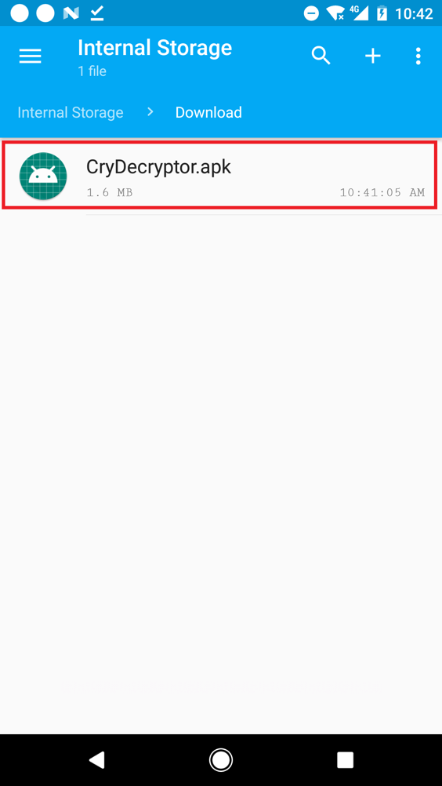
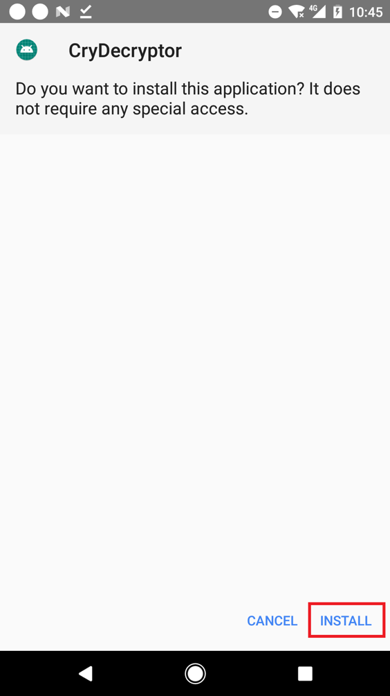
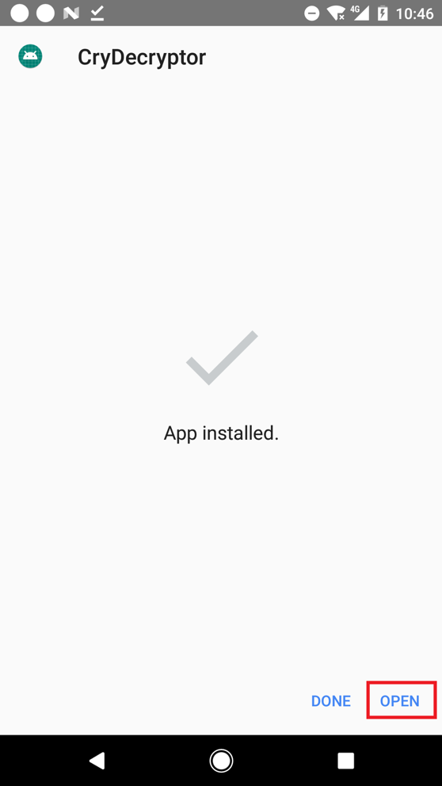
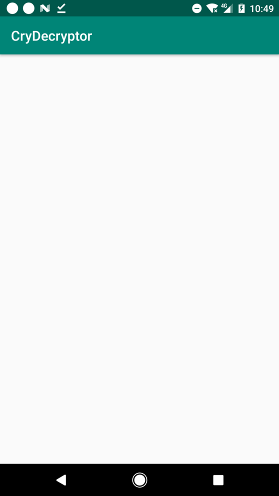

= CryDecryptor

This application decrypts files on Android devices compromised with the
CryCryptor ransomware.

You can find a pre-built Android application package in the
https://github.com/eset/cry-decryptor/releases[release section].

For a detailed analysis of the CryCryptor ransomware, see ESET researchers'
article https://www.welivesecurity.com/2020/06/24/new-ransomware-uses-covid19-tracing-guise-target-canada-eset-decryptor/["New
ransomware uses COVID-19 tracing guise to target Canada; ESET offers decryptor"] on
https://www.welivesecurity.com[WeLiveSecurity].

== Usage

If your device was infected with CryCryptor, here is a tutorial on how to
decrypt your files.

1. Open this page (https://github.com/eset/cry-decryptor) using your mobile
   device and tap the link below to download ESET's CryDecryptor tool:
+
https://github.com/eset/cry-decryptor/releases/download/v1.0/CryDecryptor.apk

2. Access the file in your "Download" folder and tap it to launch the
   CryDecryptor installation.
+

3. Tap "Install".
+

4. Once installed tap on "Open" to launch CryDecryptor or find the CryDecryptor
   app on your Home screen.
+

5. CryDecryptor tool will automatically try to launch the decryption process
   of the ransomware.
+

